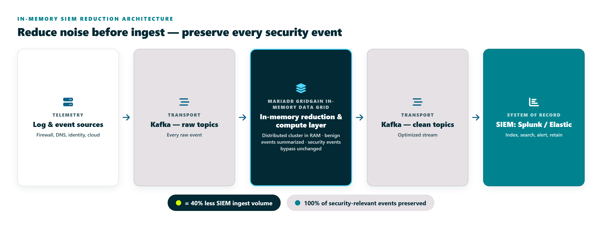

# MariaDB GridGain SIEM Reduction Reference Architecture

## Executive Summary

This repository is an **SIEM Optimization Reference Architecture and
Reference Implementation**. It demonstrates how Kafka, MariaDB GridGain, and a
continuous reduction service can reduce SIEM-bound telemetry before it reaches
Splunk, Elastic, or another downstream SIEM.

Kafka transports raw and clean telemetry events. MariaDB GridGain 8 maintains
Distributed Reduction State across a local three-node embedded cluster.
Security-relevant events bypass reduction and are preserved. Clean Kafka topics
carry reduced telemetry to the downstream SIEM, while a live operational
dashboard shows reduction, security preservation, MariaDB GridGain proof metrics, and
business impact.

## Project Status

**Status:** Reference Implementation Complete (v1.0.0)

This repository contains the completed reference implementation of the SIEM Optimization Reference Architecture. It validates the architecture using real Kafka, MariaDB GridGain 8 distributed reduction state, continuous stream processing, and a live operational dashboard.

## What This Repository Demonstrates

- Real Kafka ingestion and publication.
- Continuous streaming reduction.
- MariaDB GridGain 8 Distributed Reduction State.
- Distributed ownership proof.
- Security-event preservation.
- Live operational dashboard.
- Business impact estimation.

## Reference Implementation Scope

This repository is a local reference implementation intended to validate the
architecture. It is not presented as a production-ready deployment and
intentionally omits production concerns such as HA deployment, enterprise
security configuration, and operational observability.

## Architecture Diagram



The diagram shows telemetry sources, Kafka raw topics, the MariaDB GridGain-backed
reduction layer, Kafka clean topics, downstream SIEM consumption, and the
dashboard/business impact view.

## Architecture

The implemented reference flow is:

```text
Telemetry Sources
  -> Kafka Raw Topics
  -> Continuous Kafka Consumer
  -> Window Assignment
  -> MariaDB GridGain 8 Distributed Reduction Layer
  -> Kafka Clean Topics
  -> SIEM
  -> Live Dashboard
```

Separation of responsibilities:

- Kafka transports telemetry.
- MariaDB GridGain 8 maintains Distributed Reduction State.
- The SIEM remains the downstream system of record.

Synthetic telemetry generators produce firewall CEF, DNS syslog, Windows Active
Directory, and Cloud / Zero Trust JSON logs. The real Kafka producer writes
events to `raw-*` topics. The continuous reducer consumes raw topics, assigns
events to time windows, preserves security-relevant events immediately, reduces
repetitive benign events by Reduction Key, and publishes clean output to
`clean-*` topics.

## Why MariaDB GridGain?

MariaDB GridGain demonstrates Distributed Reduction State shared across a cluster.
That differentiates the reference implementation from a single-process cache:
state ownership, backup ownership, touched partitions, and local cache entries
can be shown across multiple embedded nodes. This complements Kafka's role as
the event transport layer; MariaDB GridGain does not replace Kafka, and Kafka does not
provide the shared in-memory reduction state shown here.

The current reference implementation demonstrates this pattern locally with an
embedded three-node MariaDB GridGain 8-compatible cluster. It validates the architecture
before adding production deployment packaging or MariaDB GridGain Enterprise runtime
artifacts.

## Why This Matters

Enterprise and public-sector environments can generate high volumes of repetitive operational
telemetry. Sending every benign duplicate to a SIEM increases ingest cost,
indexing load, storage pressure, retention constraints, and analyst noise.

This reference implementation shows how an inline optimization layer can reduce
SIEM-bound volume while preserving security-relevant events. The result is more
infrastructure headroom, longer searchable retention, and less low-value telemetry
arriving at Splunk, Elastic, or another SIEM.

## Current Reference Implementation

| Capability | Status |
|------------|--------|
| Synthetic Log Generation | Complete |
| Real Kafka Integration | Complete |
| Continuous Kafka Processing | Complete |
| Distributed Reduction Engine | Complete |
| Distributed Reduction State | Complete |
| 3-node Embedded MariaDB GridGain 8 Cluster | Complete |
| Distributed Ownership Proof | Complete |
| Security Event Preservation | Complete |
| Windowed Streaming Processing | Complete |
| Live Operational Dashboard | Complete |
| Business Impact Modeling | Complete |

## Future Enhancements

| Enhancement | Status |
|-------------|--------|
| Multi-host MariaDB GridGain cluster | Future |
| Kubernetes deployment | Future |
| TLS/SASL Kafka security | Future |
| Prometheus/Grafana/OpenTelemetry integration | Future |
| Enterprise authentication/RBAC | Future |
| Production SIEM integration | Future |

## Key Features

- Synthetic firewall CEF, DNS syslog, Windows Active Directory, and Cloud /
  Zero Trust JSON logs.
- Real Kafka raw-topic producer and clean-topic reducer/publisher.
- Continuous reducer mode with graceful Ctrl+C shutdown.
- Windowed streaming reduction with configurable window size.
- Security-relevant events bypass reduction and are counted separately.
- Three-node embedded MariaDB GridGain 8 cluster for Distributed Reduction State.
- Distributed ownership proof across embedded MariaDB GridGain nodes.
- Static dashboard for direct and simulated modes.
- Embedded live HTTP dashboard for continuous real Kafka mode.
- Business impact estimates for TB/day saved, monthly savings, and retention
  extension.

## Demo Modes

| Mode | Command Shape | Purpose |
|------|---------------|---------|
| Direct | `--mode direct --reducer inmemory` | Fast conservative local reduction run. |
| Kafka Simulation | `--mode kafka-sim --reducer inmemory` | Shows raw topics, reduction, clean topics, and downstream SIEM flow without a broker. |
| Kafka Simulation + Streaming | `--mode kafka-sim --streaming --window-seconds 60` | Simulates time-windowed telemetry processing. |
| Real Kafka Producer | `--mode kafka-produce` | Writes generated events to real Kafka raw topics. |
| Real Kafka Reducer | `--mode kafka-reduce` | Bounded or continuous raw-topic consumer, windowed reducer, and clean-topic publisher. |
| MariaDB GridGain Mode | `--reducer gridgain` | Uses the MariaDB GridGain-based reducer with three embedded local nodes. |
| Live Dashboard | `--mode kafka-reduce --continuous --dashboard` | Starts the local live dashboard for continuous Kafka mode. |

## Live Operational Dashboard

Continuous real Kafka mode can start an embedded HTTP dashboard:

```powershell
.\scripts\run-gridgain-demo.ps1 --mode kafka-reduce --continuous --dashboard --dashboard-port 8080 --metrics-interval-seconds 10 --bootstrap-servers localhost:9092 --poll-ms 1000 --window-seconds 60 --create-topics
```

Open:

```text
http://localhost:8080/
```

The live dashboard uses Java's built-in `HttpServer` and no external web
framework. It shows records seen, valid consumed events, produced clean events,
reduction percentage, malformed records, security preservation, windows
processed, open windows, raw and clean topic counts, MariaDB GridGain node/cache proof
metrics, and distributed ownership proof.

The dashboard is local demo visibility only. It has no authentication, no TLS,
and no production observability retention.

## Static Dashboard

For direct and simulated modes, `--dashboard` generates a self-contained HTML
file at:

```text
target/demo-dashboard.html
```

The static dashboard includes raw vs reduced event bars, topic metrics, window
metrics, MariaDB GridGain proof metrics, business impact estimates, embedded JSON data,
and small local JavaScript for section toggles. No web server is required.

## Sample Console Output

Representative output from MariaDB GridGain mode:

```text
MariaDB GridGain SIEM Reduction Demo
Reducer mode: gridgain / embedded Apache Ignite
Ignite Proof Metrics
- cache name: siem-reduction-state
- reduction state bucket count: 22
- embedded node count: 3
- cache mode: PARTITIONED
- cache atomicity: ATOMIC
- backup count: 1
- primary owner nodes observed: 3 / 3
- backup owner nodes observed: 3 / 3
- primary reduction state ownership by node: node-1=8, node-2=7, node-3=7
- backup reduction state ownership by node: node-1=7, node-2=8, node-3=7
- partitions touched: 22
Overall Metrics
Raw events: 10000
Reduced events: 6000
Reduction: 40.00%
Security events preserved: 331 / 331
```

Actual counts vary by mode, window size, target reduction, Kafka offsets, and
topic contents. Security events should always show full preservation.

## Real Kafka Commands

Produce synthetic raw events:

```powershell
.\scripts\run-gridgain-demo.ps1 --mode kafka-produce --events 10000 --bootstrap-servers localhost:9092 --create-topics
```

Run a bounded reducer:

```powershell
.\scripts\run-gridgain-demo.ps1 --mode kafka-reduce --bootstrap-servers localhost:9092 --run-seconds 60 --poll-ms 1000 --window-seconds 60 --create-topics
```

Run a continuous reducer:

```powershell
.\scripts\run-gridgain-demo.ps1 --mode kafka-reduce --continuous --metrics-interval-seconds 10 --bootstrap-servers localhost:9092 --poll-ms 1000 --window-seconds 60 --create-topics
```

`--run-seconds 0` is accepted as an alias for continuous mode.

For repeatable demos, use a unique consumer group id:

```powershell
.\scripts\run-gridgain-demo.ps1 --mode kafka-reduce --continuous --consumer-group-id siem-demo-%USERNAME%-%DATE% --bootstrap-servers localhost:9092 --create-topics
```

The real Kafka commands require an already running Kafka broker.

## Commit And Delivery Semantics

The Kafka reducer uses manual synchronous commits with auto-commit disabled.
Offsets are committed after successful clean-topic flushes when buffered benign
windows have been closed. In continuous mode, open-window offsets may lag until
the window closes or Ctrl+C graceful shutdown force-closes open windows.

This provides at-least-once behavior for the reference implementation.
Duplicate clean events are possible after failure, and exactly-once semantics
are not included.

## Business Value

- First proof point: meaningful SIEM-bound log reduction.
- Second proof point: security-relevant events are preserved.
- Third proof point: reduced ingest volume creates more infrastructure headroom
  and supports longer searchable retention in Splunk, Elastic, or another SIEM.
- Technical proof point: MariaDB GridGain mode shows Distributed Reduction State
  and distributed ownership proof, which is stronger than a local Java cache for
  high-volume shared-state processing.
- Positioning: Kafka transports telemetry, MariaDB GridGain 8 maintains Distributed
  Reduction State, and the SIEM remains the downstream system of record.

## Repository Structure

```text
pom.xml
README.md
docs/
scripts/run-gridgain-demo.ps1
src/main/java/com/gridgain/demo/siem/
  Main.java
  dashboard/      Static and live dashboards plus business impact estimates
  event/          Log event model and source types
  generator/      Synthetic log generators
  kafka/          Real Kafka producer, reducer, codecs, and metrics
  metrics/        Console and dashboard metrics
  pipeline/       Direct, Kafka simulation, and windowed pipelines
  reduction/      Reduction service interface and implementations
  streaming/      Time windows and window metrics
  topic/          In-memory topic abstraction
src/test/java/com/gridgain/demo/siem/
```

## Build And Test

```bash
mvn test
```

## CLI Options

```text
--mode direct
--mode kafka-sim
--mode kafka-produce
--mode kafka-reduce
--events 10000
--target-reduction 40
--reducer inmemory
--reducer gridgain
--ignite-nodes 3
--streaming
--windowed
--window-seconds 60
--dashboard
--dashboard-file target/demo-dashboard.html
--avg-event-bytes 1200
--cost-per-tb 500
--retention-days 30
--bootstrap-servers localhost:9092
--run-seconds 60
--poll-ms 1000
--consumer-group-id gridgain-siem-reducer
--create-topics
--topic-partitions 3
--topic-replication-factor 1
--verbose-windows
--continuous
--metrics-interval-seconds 10
--dashboard-port 8080
```

## Recommended Demo Flow

1. Show the architecture diagram.
2. Explain the separation of responsibilities: Kafka transports telemetry,
   MariaDB GridGain 8 maintains Distributed Reduction State, and the SIEM remains
   the downstream system of record.
3. Produce synthetic events to Kafka raw topics.
4. Run the continuous reducer with the live dashboard.
5. Review raw events, clean events, reduction percentage, malformed records,
   and security-event preservation.
6. Show MariaDB GridGain proof metrics: three embedded nodes, partitioned cache, backup
   count, and distributed ownership proof.
7. Open `http://localhost:8080/` and review live operational metrics.
8. Discuss the future roadmap for multi-host MariaDB GridGain, enterprise security,
   Kubernetes, production observability, and SIEM integration.

## Implementation Notes

Security-relevant events bypass reduction and are reported separately. The
console report prints a warning if the preserved security-relevant event count
is ever lower than the observed security-relevant event count.

MariaDB GridGain mode on modern JDKs requires JVM module flags. The
`scripts/run-gridgain-demo.ps1` helper sets those flags before starting
MariaDB GridGain mode.

## Design Goals

This reference implementation was built around a few core architectural principles:

- Preserve all security-relevant events.
- Reduce repetitive benign telemetry before SIEM ingestion.
- Separate event transport (Kafka) from distributed reduction state (MariaDB GridGain 8).
- Demonstrate distributed processing using a lightweight embedded MariaDB GridGain 8 cluster.
- Keep the implementation dependency-light and easy to run locally.
- Validate the reference architecture before introducing production deployment concerns.
